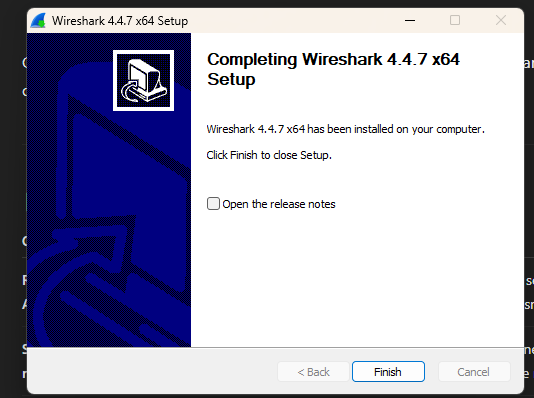

# Wireshark Lab

## Goal
Analyze a PCAP file to identify suspicious file exfiltration over FTP, HTTP, or DNS tunneling.

## Tools Needed
-Wireshark
-PCAP file to analyze

## Scenario
You're a SOC analyst reviewing network traffic after a security alert. Your job is to:

1. Find unusual data transfers
2. Identify potential file exfiltration
3. Document IPs, protocols, and user credentials if found

## PCAP File
<a href="https://www.cloudshark.org/captures/abdc8742488f" target="_blank">cloudshark.org/captures/abdc8742488f</a>

## Screenshots

## What I Learned

The user logged in anonymously using USER and the username and PASS as the password</li>

