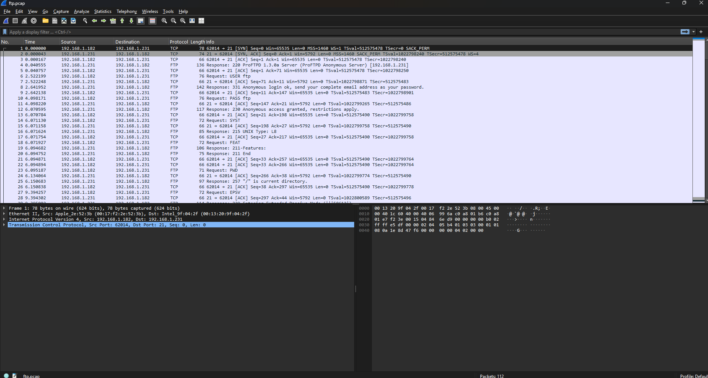
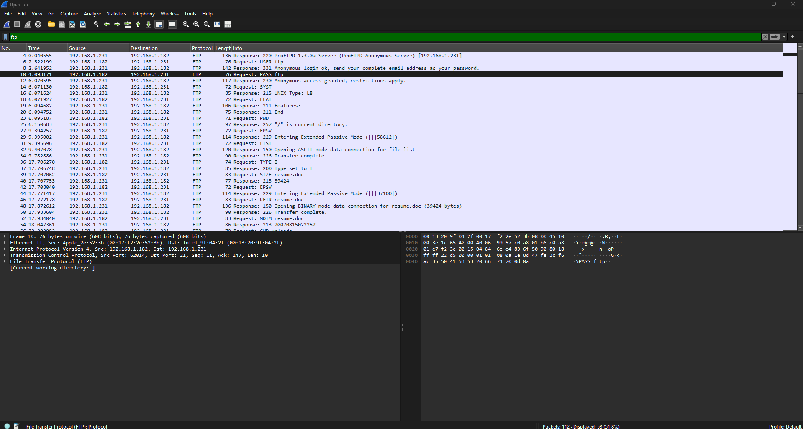
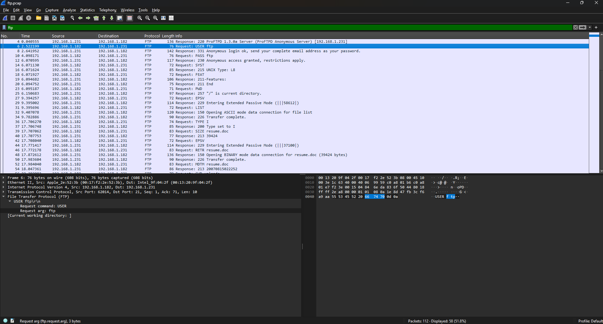
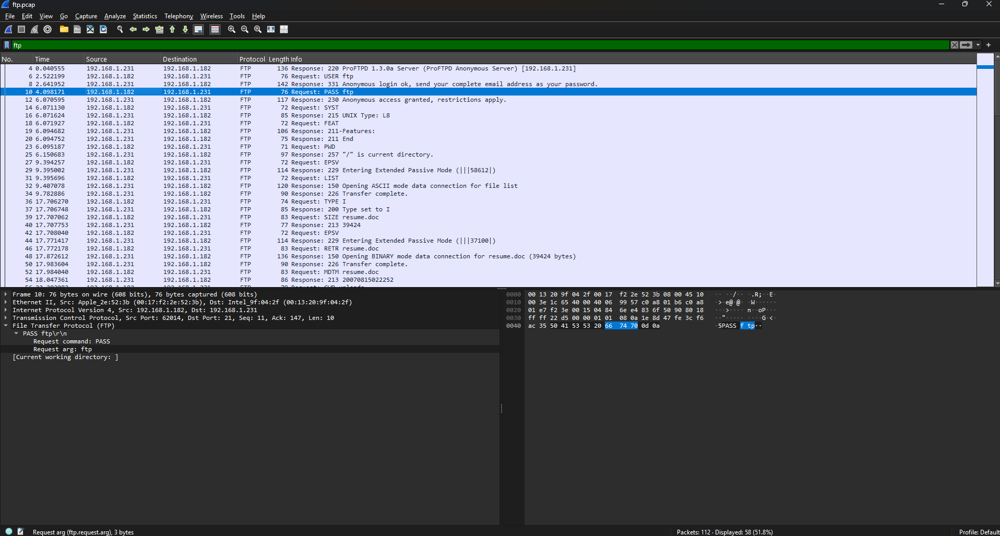
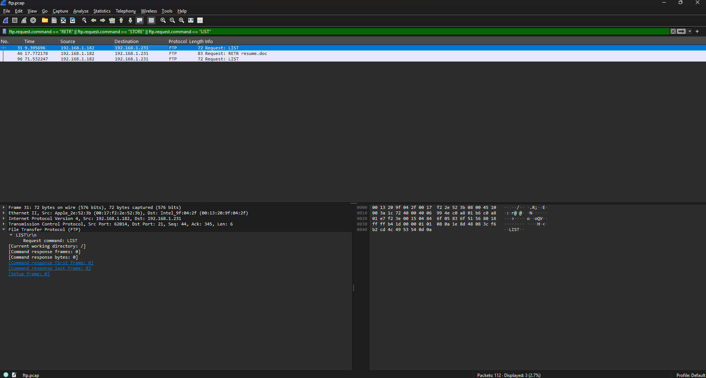
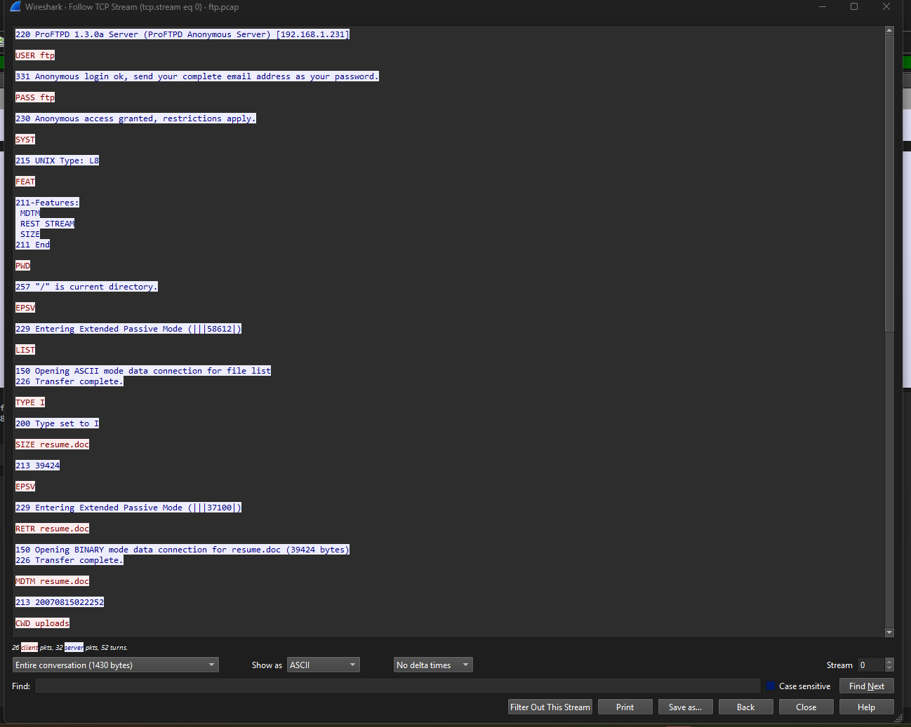
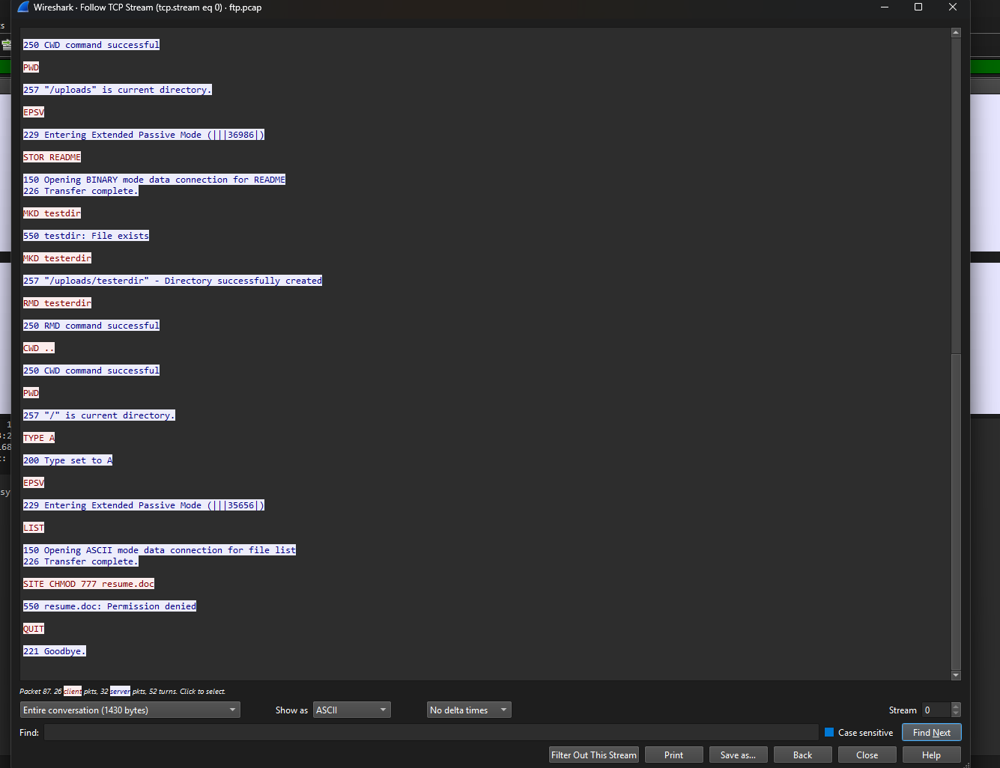

# Wireshark Lab

## Goal
Analyze a PCAP file to identify suspicious file exfiltration over FTP, HTTP, or DNS tunneling.

## Tools Needed
-Wireshark
-PCAP file to analyze

## Scenario
You're a SOC analyst reviewing network traffic after a security alert. Your job is to:

1. Find unusual data transfers
2. Identify potential file exfiltration
3. Document IPs, protocols, and user credentials if found

## PCAP File
<a href="https://www.cloudshark.org/captures/abdc8742488f" target="_blank">cloudshark.org/captures/abdc8742488f</a>

## Screenshots

Downloaded Wireshark

Opened the packet file

Filter the packets by FTP

The packet with the "USER" details

The packet with the "PASS" details

Sorted all packets by STORE, LIST, and RETR commands

Following the TCP stream to track activity

Following the TCP stream to track activity cont.

## What I Learned
1.The user logged in anonymously using "USER" as the username and "PASS" as the password

2.The user used the PWD command to see the current directory

3.The user used the LIST command to list all files in current directory
4.The user set the type mode to "I" to prevent file damage during transfer
5.The user checked the size of the file using the SIZE command
6.The user downloaded the file using the RETR command
7.The user used the MDTM command to check the file meta data like date and time
8.The user changed the directory to "uploads"
9.The user used the PWD command to verify their location
10.The user uploaded the resume.doc file into the current directory
11.The user created a "testdir" folder
12.The user created a "testerdir" folder
13.The user deleted the "testerdir" folder
14.The user changed to the parent directory
15.The user used the PWD command to verify their location
16.The user used the TYPE A command to switch to Type A before listing directories for cleaner formatting
17.The user used the LIST command to list all files in current directory
18.The user attempted to update file permissions to 777 to allow full-access to all users
19.The request was denied by the server.
20.The user used the QUIT command to terminate session 

